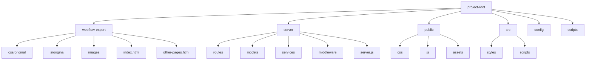

# Personalized Health Tracker

Many patients globally do not have complete access to their healthcare records.
Even when they do, the information is not provided in a way that allows patients
to understand their data while being provided with actionable takeaways.
Building a digital EHR is a big endeavour. My goal with this project is to built
a MVP/prototype to see if I can make the content management system(CMS) work as
intended.

This project was originally built with [WebFlow](https://WebFlow.com). WebFlow
is a great tool for HTML, CSS & JavaScript. On the downside, once you use their
CMS, it cannot be exported. I decided to export the code at this stage before
integrating a user authentication system, database/CMS, cybersecurity/PIPEDA
compliance, and other tools. Since exporting the original code, I have been
updating the code to ensure it is more readible, maintainable and scalable. The
remainder of this project will be built in VS code.

Other notes:

- The report bar charts & graphs were built with
  [Apex Charts](https://apexcharts.com/)
- Modals can be found on the Profile page.

Please see the currently deployed site here: https://healthdashboard.webflow.io/

Here is the VS code folder structure I am currently using:



Things to consider as the project scales:

- Implementing a build process to optimize Webflow-exported assets.
- Setting up environment-specific configurations.
- Implementing server-side rendering if needed for performance or SEO.

Once the folder structure is ready, install the necessary dependencies for
PostgreSQL. This installs PostgreSQL driver, Sequelize ORM, and dotenv for
environment variable management.

```pwsh
npm install pg sequelize dotenv
```

Create an env file in your root project to store database credentials. Be sure
to include .env in your gitignore file.
