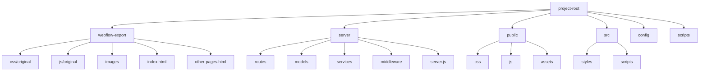

# Personalized Health Tracker

Many patients globally do not have complete access to their healthcare records.
Even when they do, the information is not provided in a way that allows patients
to understand their data while being provided with actionable takeaways.
Building a digital EHR is a big endeavour. My goal with this project is to built
a MVP/prototype to see if I can make the content management system(CMS) work as
intended.

This project was originally built with [WebFlow](https://WebFlow.com). WebFlow
is a great tool for HTML, CSS & JavaScript. On the downside, once you use their
CMS, it cannot be exported. I decided to export the code at this stage before
integrating a user authentication system, database/CMS, cybersecurity/PIPEDA
compliance, and other tools. Since exporting the original code, I have been
updating the code to ensure it is more readible, maintainable and scalable. The
remainder of this project will be built in VS code.

Other notes:

- The report bar charts & graphs were built with
  [Apex Charts](https://apexcharts.com/)
- Modals can be found on the Profile page.

Please see the currently deployed site here: https://healthdashboard.webflow.io/

Here is the VS code folder structure I am currently using:



Things to consider as the project scales:

- Implementing a build process to optimize Webflow-exported assets.
- Setting up environment-specific configurations.
- Implementing server-side rendering if needed for performance or SEO.

Once the folder structure is ready, install the necessary dependencies for
PostgreSQL. This installs PostgreSQL driver, Sequelize ORM, and dotenv for
environment variable management.

```pwsh
npm install pg sequelize dotenv
```

Create an env file in your root project to store database credentials. Be sure
to include .env in your gitignore file.

Install PostgreSQL and OpenSSL from their respective websites.

Navigate to the directory where you want to save the certificate and key files.
For PostgreSQL, this is typically the data directory, but you can generate them
anywhere and move them later. Run the following command as an administrator to
generate both the certificate and key in one step:

```pwsh
$openssl = 'C:\Program Files\OpenSSL-Win64\bin\openssl.exe'
```

```pwsh
& $openssl req -new -x509 -days 365 -nodes -text -out server.crt -keyout server.key -subj "/CN=localhost" -config 'C:\Program Files\OpenSSL-Win64\bin\cnf\openssl.cnf'
```

Let's break down this command:

<li> req: This is the command for X.509 Certificate Signing Request (CSR) management.</li>
<li> -new: Creates a new certificate request.</li>
<li> -x509: Outputs a self-signed certificate instead of a certificate request.</li>
<li> -days 365: The number of days the certificate will be valid.</li>
<li> -nodes: Creates a key without a passphrase.</li>
<li> -text: Outputs the certificate in plain text.</li>
<li> -out server.crt: Specifies the output filename for the certificate.</li>
<li> -keyout server.key: Specifies the output filename for the private key.</li>
<li> -subj "/CN=localhost": Sets the subject of the certificate. Replace "localhost" with your server's domain name if applicable.</li>

Check your /data folder or run the following to verify that the following files
were created:

```pwsh
Get-ChildItem server.crt, server.key
```

you can now update your postgresql.conf file with the paths to these files. Add
or modify these lines in postgresql.conf:

```config
ssl = on
ssl_cert_file = 'server.crt'
ssl_key_file = 'server.key'
```

** At this point we have a self-signed certificate, which is fine for
development or testing purposes. For a production environment, especially one
handling sensitive medical data, you should obtain a certificate from a trusted
Certificate Authority (CA). **

Restarting your PostgreSQL service is an important step to apply the changes
we've made. Here's how you can do it on Windows:

Using the Services application: a. Press Win + R to open the Run dialog. b. Type
"services.msc" and press Enter. c. Scroll down to find the PostgreSQL service.
It will likely be named something like "postgresql-x64-17" (where 17 is your
version number). d. Right-click on the service and select "Restart".

Next install
[pgAdmin](https://www.postgresql.org/ftp/pgadmin/pgadmin4/v8.12/windows/) from
the website. pgAdmin is a powerful, open-source tool designed for managing
PostgreSQL databases. PgAdmin4 is a complete rewrite of pgAdmin, built using
Python and Javascript/jQuery.
